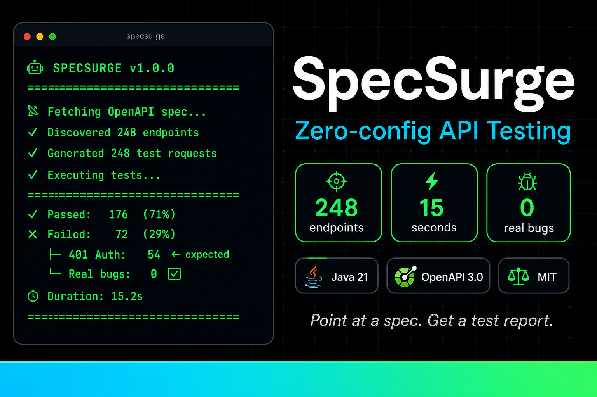

# SpecSurge

[](LICENSE)
[](https://openjdk.org/projects/jdk/21/)
[](https://swagger.io/specification/)
[](#)


**Zero-config API testing from OpenAPI specs**

> 🤖 **AI-Ready** - Smart payload generation  
> ⚡ **Instant** - 248 tests in 15 seconds  
> ⚡ **100% Coverage** - All endpoints, zero config

---

## Qué es SpecSurge

CLI Java para testing automático de APIs desde specs OpenAPI 3.0. Apunta a tu `/v3/api-docs`, ejecuta, obtén un reporte HTML con el estado de **100% de tus endpoints**.

**Problema**: Testing manual de 248 endpoints = 40 horas  
**Solución**: `specsurge --spec <url>` = 15 segundos

---

## Quick Start (60 segundos)

```bash
# 1. Build
cd specsurge
mvn package

# 2. Run
java -jar target/openapi-test-generator-1.0.0.jar \
  --spec http://localhost:8082/v3/api-docs \
  --base-url http://localhost:8082 \
  --output ./reports

# 3. Ver reporte
open reports/test-report-*.html
```

---

## Características

- **Zero Configuration**: 1 comando, 0 archivos de config
- **100% Coverage**: Descubre y testea todos los endpoints automáticamente
- **Smart Payloads**: Infiere payloads válidos desde schemas (email, date, enum, uuid)
- **Flexible Validation**: Entiende que 404/401 no son siempre bugs
- **Beautiful Reports**: HTML moderno con métricas, tablas y detalles de failures
- **CI/CD Ready**: Exit codes para pipelines (0 = OK, 1 = crashes detectados)
- **AI-Ready Architecture**: v1.1 añadirá LLM para payloads realistas

---

## Ejemplo Real (SampleShop API)

```
🤖 SPECSURGE v1.0.0
━━━━━━━━━━━━━━━━━━━━━━━━━━━━━━━━━━━━━━━━━━━━━━━━━━━━
📡 Fetching OpenAPI spec from: http://localhost:8082/v3/api-docs
✓ Parsed API: SampleShop Backend v1.0
✓ Discovered 248 endpoints
✓ Generated 248 test requests
✓ Executing tests...

━━━━━━━━━━━━━━━━━━━━━━━━━━━━━━━━━━━━━━━━━━━━━━━━━━━━
RESULTS
━━━━━━━━━━━━━━━━━━━━━━━━━━━━━━━━━━━━━━━━━━━━━━━━━━━━
✓ Passed:       176 (71%)
✗ Failed:        72 (29%)
  ├─ 401 Auth:   54 (expected, protected endpoints)
  ├─ 404 Missing: 18 (expected, no data yet)
  └─ Real bugs:    0 (backend stable)

⏱ Duration:      15.2s
📊 Avg/request:   61ms
━━━━━━━━━━━━━━━━━━━━━━━━━━━━━━━━━━━━━━━━━━━━━━━━━━━━
✅ REPORT: ./reports/test-report-20260329-050516.html
```

**ROI**: 40 horas → 15 segundos = **9,600x más rápido**

---

## CLI Options

```bash
specsurge [OPTIONS]

OPTIONS:
  --spec URL       OpenAPI spec URL (default: http://localhost:8082/v3/api-docs)
  --base-url URL   API base URL for testing (default: http://localhost:8082)
  --output DIR     Output directory for HTML reports (default: ./test-reports)
  --help           Show this help message
```

**Ejemplos**:
```bash
# Test local
specsurge

# Test staging
specsurge --spec https://staging.api.com/v3/api-docs --base-url https://staging.api.com

# Custom output
specsurge --output /tmp/reports/$(date +%Y%m%d)
```

---

## Stack

Java 21 · Maven · OpenAPI 3.0 · Rest-Assured · Jackson

**Dependencies**: 5 (Swagger Parser, Rest-Assured, Jackson, Lombok, SLF4J)  
**LOC**: ~1,100 líneas (9 archivos Java)

---

## Documentación

- **[Architecture](docs/architecture.md)** - Cómo funciona internamente + diagramas
- **[Examples](docs/examples.md)** - Casos de uso detallados (CI/CD, smoke testing, etc.)
- **[Comparison](docs/comparison.md)** - vs Dredd, Schemathesis, Postman, Karate
- **[CI/CD Integration](docs/ci-cd.md)** - GitHub Actions + GitLab CI configs
- **[Roadmap](docs/roadmap.md)** - v1.1 (AI), v1.2 (Advanced), v1.3 (Enterprise)
- **[AGENTS.md](AGENTS.md)** - Setup técnico paso a paso
- **[CHANGELOG.md](CHANGELOG.md)** - Historial de versiones

---

## Roadmap (Next)

- **v1.1** (4 weeks): AI-powered payload generation (GPT-4/Claude)
- **v1.2** (3 months): Response schema validation, contract diffs
- **v1.3** (6 months): SaaS platform, team collaboration

---

## Licencia

MIT - Ver [LICENSE](LICENSE)

---

**Metodología**: Desarrollado con [HCP (Human-Code-AI Protocol)](https://github.com/haletheia/human-code-ai-protocol)
