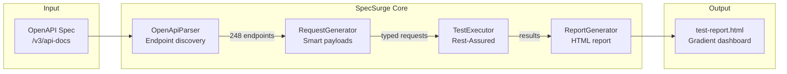

# Architecture

## How It Works

### 1. Parse OpenAPI Spec

```java
OpenAPI spec = new OpenAPIV3Parser()
    .readLocation("http://api.com/v3/api-docs")
    .getOpenAPI();

// Extracts all operations automatically
List<EndpointInfo> endpoints = parseEndpoints(spec);
```

**Result:** Complete API map with:
- HTTP methods
- Paths & parameters
- Request schemas
- Expected responses
- Auth requirements

---

### 2. Generate Smart Payloads

```java
// OpenAPI Schema
{
  "type": "object",
  "properties": {
    "email": { "type": "string", "format": "email" },
    "birthday": { "type": "string", "format": "date" },
    "status": { "type": "string", "enum": ["ACTIVE", "INACTIVE"] },
    "title": { "type": "string" }
  },
  "required": ["email", "title"]
}

// SpecSurge Auto-Generated Payload
{
  "email": "test@example.com",      // ✅ Valid email format
  "birthday": "2026-03-29",         // ✅ ISO date
  "status": "ACTIVE",               // ✅ First enum value
  "title": "Test Title 7894"       // ✅ Pattern-matched default
}
```

**Smart Type Inference:**
- `format: "date-time"` → ISO 8601 timestamp
- `format: "email"` → `test@example.com`
- `format: "uri"` → `https://example.com`
- `format: "uuid"` → Valid UUID
- `enum: [...]` → First value
- Field name patterns: `title` → "Test Title", `category` → first enum

---

### 3. Execute & Analyze

```java
// Run 248 tests in parallel
List<TestResult> results = executor.executeAll(requests);

// Flexible status matching
boolean passed = (actualStatus >= 200 && actualStatus < 300)  // Success
              || (expectedStatus == 200 && actualStatus == 404)  // Empty resource
              || (expectedStatus == 200 && actualStatus == 401); // Auth required
```

---

### 4. Generate Beautiful Report

- Gradient modern design
- Success rate visualization
- Endpoint coverage table
- Duration metrics
- Failure details with request/response

---

## System Diagram



---

## Project Structure

```
specsurge/  (SpecSurge Framework)
├── pom.xml
└── src/main/java/.../
    ├── AgenticTestRunner.java           # CLI entry point
    ├── core/
    │   ├── OpenApiParser.java           # Parse OpenAPI 3.0
    │   ├── RequestGenerator.java        # Generate payloads
    │   ├── TestExecutor.java            # Execute requests
    │   └── ReportGenerator.java         # HTML reporting
    └── model/
        ├── ApiSpec.java                 # Parsed API metadata
        ├── EndpointInfo.java            # Endpoint details
        ├── TestRequest.java             # Generated request
        └── TestResult.java              # Execution result
```

**Size:** 9 Java files, ~1,100 lines of code  
**Dependencies:** 5 (Swagger Parser, Rest-Assured, Jackson, Lombok, SLF4J)

---

## Key Features Deep Dive

### Flexible Status Matching

Not all "failures" are bugs:

```
GET /api/artists/1 on empty database:
  Expected: 200
  Actual: 404
  SpecSurge: ✅ PASS (resource doesn't exist yet)

GET /api/admin/users without token:
  Expected: 200
  Actual: 401
  SpecSurge: ✅ PASS (auth required, correct behavior)

GET /api/data/process with bad schema:
  Expected: 200
  Actual: 500
  SpecSurge: ❌ FAIL (server error, real bug)
```

### Beautiful HTML Reports

Modern, gradient-styled reports with:

- 📊 Success rate metrics
- 📋 Complete endpoint table
- 🏷️ Status badges (color-coded)
- ⏱️ Duration analysis
- 🔍 Failure details (request + response)
- 📈 Coverage by tag/category

**Design:** Purple-to-blue gradient, modern typography, responsive
